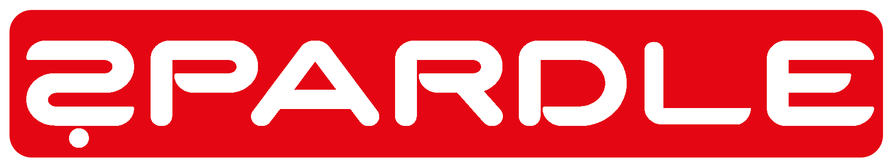

<!-- PROJECT SHIELDS -->
<!--
*** I'm using markdown "reference style" links for readability.
*** Reference links are enclosed in brackets [ ] instead of parentheses ( ).
*** See the bottom of this document for the declaration of the reference variables
*** for contributors-url, forks-url, etc. This is an optional, concise syntax you may use.
*** https://www.markdownguide.org/basic-syntax/#reference-style-links
-->

<!-- PROJECT LOGO -->
 

  

<h3 align="center">SPARDLE</h3>

  

    A small daily-game where one has to guess prices of Spar Austria products
     
    <a href="https://github.com/Valletix/spardle.at"><strong>Explore the docs »</strong></a>
     
     
    <a href="https://spardle.at">View Demo</a>
    &middot;
    <a href="https://github.com/Valletix/spardle.at/issues/new?labels=bug&template=bug-report---.md">Report Bug</a>
    &middot;
    <a href="https://github.com/Valletix/spardle.at/issues/new?labels=enhancement&template=feature-request---.md">Request Feature</a>
  

<!-- TABLE OF CONTENTS -->

  
Table of Contents

  <ol>
    <li>
      <a href="#about-the-project">About The Project</a>
      <ul>
        <li><a href="#built-with">Built With</a></li>
      </ul>
    </li>
    <li><a href="#contact">Contact</a></li>
    <li><a href="#acknowledgments">Acknowledgments</a></li>
  </ol>

<!-- ABOUT THE PROJECT -->
## About The Project

[![Product Name Screen Shot][product-screenshot]](https://spardle.at)

(<a href="#readme-top">back to top</a>)

Spardle is a little daily-game where you have six attempts to guess the price of a product at Spar Austria.

Every day, there is a new, random product from the Spar range. If a product is currently on special offer, the original price applies. After each attempt, you will receive a hint about how far off the price you are.

### Built With

* [![Python]][Python-url]
* [![JavaScript]][JavaScript-url]
* [![HTML]][HTML-url]
* [![CSS]][CSS-url]

(<a href="#readme-top">back to top</a>)

<!-- CONTACT -->
## Contact

Valentin Kaltenegger - kaltenegger.valentin@gmail.com

Project Link: [https://github.com/github_username/spardle.at](https://github.com/github_username/spardle.at)

(<a href="#readme-top">back to top</a>)

<!-- ACKNOWLEDGMENTS -->
## Acknowledgments

This Project would not have been possible without:

* [Spar Produktwelt](https://www.spar.at/produktwelt/)
* [Costcodle](https://costcodle.com/)
* [Wordle](https://www.nytimes.com/games/wordle/index.html)
* [Best-README-Template](https://github.com/othneildrew/Best-README-Template/)

(<a href="#readme-top">back to top</a>)

<!-- MARKDOWN LINKS & IMAGES -->
<!-- https://www.markdownguide.org/basic-syntax/#reference-style-links -->
[contributors-shield]: https://img.shields.io/github/contributors/github_username/spardle.at.svg?style=for-the-badge
[contributors-url]: https://github.com/github_username/spardle.at/graphs/contributors
[forks-shield]: https://img.shields.io/github/forks/github_username/spardle.at.svg?style=for-the-badge
[forks-url]: https://github.com/github_username/spardle.at/network/members
[stars-shield]: https://img.shields.io/github/stars/github_username/spardle.at.svg?style=for-the-badge
[stars-url]: https://github.com/github_username/spardle.at/stargazers
[issues-shield]: https://img.shields.io/github/issues/github_username/spardle.at.svg?style=for-the-badge
[issues-url]: https://github.com/github_username/spardle.at/issues
[license-shield]: https://img.shields.io/github/license/github_username/spardle.at.svg?style=for-the-badge
[license-url]: https://github.com/github_username/spardle.at/blob/master/LICENSE.txt
[linkedin-shield]: https://img.shields.io/badge/-LinkedIn-black.svg?style=for-the-badge&logo=linkedin&colorB=555
[linkedin-url]: https://linkedin.com/in/linkedin_username
[product-screenshot]: assets/website_screenshot.png
<!-- Shields.io badges. You can a comprehensive list with many more badges at: https://github.com/inttter/md-badges -->
[Python]: https://img.shields.io/badge/Python-3776AB?logo=python&logoColor=fff
[Python-url]: https://www.python.org/
[JavaScript]: https://img.shields.io/badge/JavaScript-F7DF1E?logo=javascript&logoColor=000
[JavaScript-url]: https://developer.mozilla.org/en-US/docs/Web/JavaScript
[HTML]: https://img.shields.io/badge/HTML-%23E34F26.svg?logo=html5&logoColor=white
[HTML-url]: https://developer.mozilla.org/en-US/docs/Web/HTML
[CSS]: https://img.shields.io/badge/CSS-639?logo=css&logoColor=fff
[CSS-url]: https://developer.mozilla.org/en-US/docs/Web/CSS
